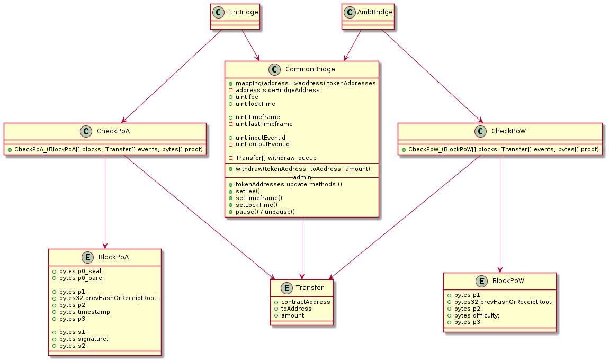
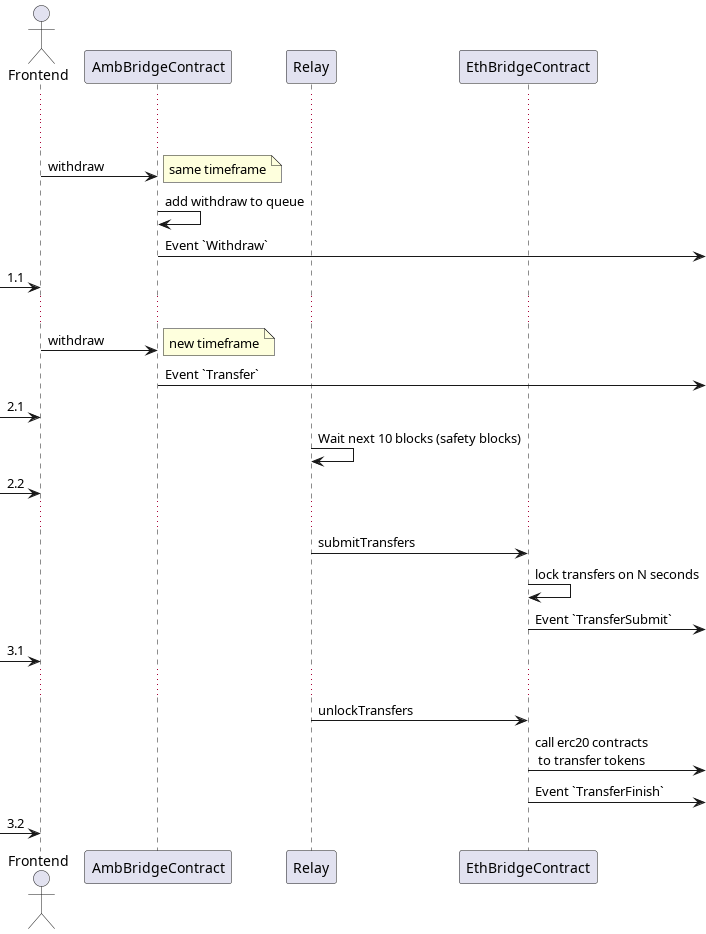

# README

### Tokens

Inside the bridge there is a division into types of tokens: primary and synthetic.

**Primary** tokens are those that already exist in a network and we plan to make it possible to transport them by bridge.

**Synthetics** tokens are the ones we create as a pair to primary ones.\
They know about the existence of the bridge and its address and **allow it to mint and burn** tokens.\
They also monitor how much and from which network funds came and do not allow to withdraw to this network more than came from it.

### Bridge

The bridge consists of **2 contracts**, one for each network and a **relay** - software that monitors these contracts and sends them user transfers.

in a nutshell, the bridge works as follows:

1. the user calls the `withdraw` function in the contract `A`; he's tokens locks on bridge contract
2. this contract emits an `Transfer` event
3. relay find new event, prepare a proof and call `submit` function on contract `B` (another network)
4. contract `B` checks (using proof) that `Transfer` event really emitted in first network by contract `A`
5. if check successful, contract `B` mint synthetic analog of primary token to user

Since for withdrawal of funds contract B independently checks that contract A actually created the Transfer event,\
and the relay is needed only to send public information,\
**the bridge can be called trustless** and therefore protected from burglary relay

### Fees

Bridge collects 2 types of commissions from the user:

* _Transfer fee_ - covering the cost of the relay performing transactions in side network
* _Bridge fee_ - percentage of the amount of tokens sent\
  Fees are converted into the native currency of the network


_**Transfer fees**_ - are processed in the following way:&#x20;

The user pays all transfer fees. When the user wants to make a transfer from the first network to the second, he will pay the transfer fee. Transfer Fee is the actual commission of the second network converted to the actual time of the first network at the time of the transaction / transfer. Example #1:

* I as a user want to transfer AMB from AMB-NET (first network) to Ethereum (second network).
* Assume that the current transaction value is the equivalent of $1 for AMB-NET and $20 for ETH. This means that the user has to pay $21 for the transfer fee
* 21$ we will convert into the native coin of the first network (AMB-NET in this case) and calculate that it will be 2800 AMB
* We charge the user transfer fee of 2800 AMB and put it on a separate wallet. Thus, we have some AMB accumulated in this wallet, but at the same time we need ETH for final transactions into ETH network.&#x20;
* For transactions in Ethereum network, we need ETH. In the beginning (when we launch our bridge in PROD), we need to allocate ETH from the project budget, but further we need a constant process of converting the received AMB as a transfer fee (2800 AMB) into ETH. We will need to keep track of the balances of several wallets, to have enough AMB and ETH on them to process transactions, otherwise, the bridge will stop working. I see this process as - in 1 day/week a certain amount of AMB is accumulated, we take it away and somehow (through CEX or DEX) convert it to ETH.

In the case of transfers from ETH (first network) to AMB-NET (second network), everything is the opposite, only in this case transfer fee, we start collecting in ETH as native Ethereum network.

_**Bridge fee**_ - are processed in the following way:&#x20;

* The bridge fee is the profit the gateway product charges users for using it. Bridge fee is set as a `% of the total transaction volume`, as well as we have a `minimum value` of commission below which it is forbidden to go.
* All values, both for limits and for the minimum values of the _commission are given to the $ equivalent_, in order to be able to set the commission for all coins which will be supported by the bridge at the stage of launch and after it.
* To `set % of total transaction volume`, set a threshold value, for example, $10000, and set % for volume up (_2% for example, and we need finalize value for PROD_) to $10k and separately set % for volume over $10k (_1% for example, and we need finalize value for PROD_). We can also use tenths of a percent, like 0.1% or 0.5%
* We also set the `minimum value`, for example, the equivalent of $ 5 (_this value we also need to change for PROD_), and then even with the volume of transactions/transfers of $ 10, we will still charge the user a commission of the equivalent of $ 5.
* The bridge fee is charged from the user, in the currency of the first network from which the user makes the transfer and is stored in separate wallets, not related to the transfer fee.

**Fees example:**&#x20;

1. We transfer 1M AMB from AMB-NET to ETH. In this case, user will pay (all values only for example):&#x20;
   1. Transfer fee from AMB net (let's think about 1$) + ETH network commission (let's think about 10$). It will be 135.13AMB for AMB-NET for  + 1351.3AMB for ETH net.&#x20;
   2. Bridge fee: 1M AMB = 7400$, it is less than $10k and we will charge 2% from the transfer amount, but not less than 5$ equivalent. 2% = 20000AMB or 148$ and we will charge this amount of fee.&#x20;
   3. Total commissions which user will pay = 135.13 + 1351.3 + 20000  = 21486,43 AMB
2. We transfer 10k AMB from AMB-NET to ETH
   1. Transfer fee from AMB net (let's think about 1$) + ETH network commission (let's think about 10$). It will be 135.13AMB for AMB-NET for  + 1351.3AMB for ETH net.&#x20;
   2. Bridge fee: 10k AMB = 74$, it is less than $10k and we will charge 2% from the transfer amount, but not less than 5$ equivalent. 2% = 200AMB or 1.48$, it less than 5$, we will charge from user 5$ or 675.67 AMB
   3. Total commissions which user will pay = 135.13 + 1351.3 + 675.67 = 2162.1 AMB&#x20;
3. We transfer 1 ETH from ETH-net to AMB-NET
   1. Transfer fee from ETH-net (let's think about 10$) it is about 0,0083 ETH + AMB network commission (let's think about 1$) \~ 0,00083 ETH. It will be 0,0083 ETH for ETH-NET for  + 0,00083 ETH for AMB-net.&#x20;
   2. Bridge fee: 1 ETH = 1200$, it is less than $10k and we will charge 2% from the transfer amount, but not less than 5$ equivalent. 2% = 0.02 Eth or 24$, it is more than 5$, we will charge from user 0.02 Eth.
   3. Total commissions which user will pay = 0,0083 + 0,00083 + 0.02 = 0,02913 ETH&#x20;


We currently have 2 networks we work with: AMB-**ETH** and AMB-**BSC**.

So, we have 4 contracts:

* `Eth_AmbBridge` - deployed on AMB, receive transfers from ETH
* `Eth_EthBridge` - deployed on ETH, receive transfers from AMB
* `Bsc_AmbBridge` - deployed on AMB, receive transfers from BSC
* `Bsc_BscBridge` - deployed on ETH, receive transfers from AMB

Each contract is inherited from `CommonBridge` and `CheckXxXxX`

`CommonBridge` is a contract that has all the code common to all contracts, such as:

* `withdraw` and `wrapWithdraw` functions - called by users to transfer tokens from this network to another.
* locking, unlocking functionality - all received transfers firstly locked for some time to avoid fraud.
* administration - functions for changing variables, roles, etc.
* verification and distribution of the fees
* and so on

`CheckXxXxX`, which can mean `CheckAura`, `CheckPoW`, `CheckPoSA`, - is contracts, that verify that `Transfer` event happened in other (side) network.

In general, these contracts do the same thing: they check that there is a `Transfer` event in a certain block with the same information that the relay sent, and also checks \~ 10 (`minSafetyBlocks` param) next blocks.

But the principle of checking blocks is different for different networks:

* `CheckAura` (for blocks from Ambrosus) - check author of each block, it must be specific validator from Validator Set.\
  `assert block.author == block.step % validatorSet.length`\
  Need to sync ValidatorSet from contract (`0x0000000000000000000000000000000000000F00`) into receiver network.
* `CheckPoSA` (for blocks from Binance Smart Chain) - check author of each block, it must be validator from Validator Set.\
  `assert validatorSet[block.author]`\
  Need to sync ValidatorSet from each epoch start block (`block.number % 200 == 0`) into receiver network.
* `CheckPoW` (for blocks from Ethereum 1.0) - check PoW hash for each block, it must be suitable with network difficulty.

For each checker relay prepare proof (`PoWProof`, `PoSAProof`, `AuraProof`) - struct, that contains necessary information, like blocks, user transfers, etc...

Smart contracts structure:

&#x20;

### Flow



#### Frontend

1.

    1. The user goes to the frontend
    2. The front-end takes a list of all tokens, their icons, etc. (avax used this source [https://raw.githubusercontent.com/ava-labs/avalanche-bridge-resources/main/token\_list.json](https://raw.githubusercontent.com/ava-labs/avalanche-bridge-resources/main/token\_list.json))
    3. The front-end makes queries to bridge smart contracts, checking that the token at the address exists and is not disabled
    4. the user calls `withdraw(tokenAddress, toAddress, amount, {value: fee})` the bridge contract in the network from which he wants to withdraw money

    ####

#### Bridge withdraw

`withdraw(address tokenThisAddress, address toAddress, uint amount, bool unwrapSide, bytes calldata feeSignature, uint transferFee, uint bridgeFee)`

1. inputs are checked
2.  the output information is added to the queue `Transfer[] withdraw_queue`

    ```
    struct Transfer {
        address tokenAddress;
        address toAddress;
        uint amount;
    }
    ```
3.  as long as the `withdraw` calls occur in one timeframe - transfers are simply added to the queue.\
    As soon as the next `withdraw` call occurs in a new timeframe: `Transfer(event_id, withdraw_queue)`:

    * Event creation `Transfer(event_id, withdraw_queue)`
    * withdraw\_queue cleared
    * event\_id incremented by 1

    _timeframe = block.timestamp / timeframe_

#### Relay

1. Relay get event `Transfer(event_id, withdraw_queue)` from AmbBridge
2. Checks that `event_id == EthBridge.inputEventId + 1`, otherwise look for Transfer with a matching event\_id
3. waits for N next blocks (safety blocks)
4. creates receipts proof (see below)
5. encodes the blocks (event and safety block) depending on the network consensus: BlockPoA or BlockPoW (see below)
6. calls EthBridge method `submitTransfers`

#### Bridge submitTransfers

```
submitTransfers(
    uint event_id,
    BlockPoA[] memory blocks,
    Transfer[] memory events,
    bytes[] memory proof
)
```

1. `require(event_id == inputEventId + 1);` - check that the events come consistently, without skipping `inputEventId++;`
2. is considered receiptsRoot, the next function checks that the block with this receiptsRoot is valid
3.  is called \_CheckPoW or \_CheckPoA, depending on the consensus of the network from which the blocks came:

    * for PoA it is checked that this block is signed and that the signature is made with the correct address (determined by the step field)
    * PoW is checked using ethash (coming soon)

    implicitly verifies that `hash(blocks[i]) == blocks[i+1].prev_hash`
4. transfers are saved to the pool of blocked transactions

#### Bridge unlockTransfers

1. takes out from the pool of blocked transactions those that are saved before `block.timestamp - lockTime`
2. transfer tokens
3. deletes executed transactions from the pool

### Extra

#### Block pre-encoding

To prove that the block is correct, you need to read its hash.

```
blockHeader = {
    ParentHash, UncleHash, Coinbase, Root, TxHash,
    ReceiptHash, 
    Bloom, Difficulty, Number, GasLimit, GasUsed,
    Time, Extra, MixDigest, Nonce
}

blockHash = keccak256(rlpEncode(blockHeader))
assert blockHash == needHash
```

The hashed value is almost always encoded in RLP (Recursive Length Prefix) first. This encoding only adds a prefix to the input value, which means that the input value with some offset is contained in the output value.\
\=> `rlpEncode(value) = rlpPrefix(value) + value`, where + means concatenation of bytes.

To save gas, relay will prepare the blocks for the smart contract so that concatenation `(abi.encodePacked)` is used instead of `rlpEncode`.

For example, relay can split `rlpEncode(header)` by separator `receiptRoot`\
`rlpParts := bytes.Split(rlpHeader, receiptRoot)`, then\
`keccak256(abi.encodePacked(rlpParts[0], receiptRoot, rlpParts[1]) == needHash`

#### Receipts proof (todo)

simplified example of merkle patricia tree:

```
receiptsRoot = hash(rlpEncode(childrens)
├── path1 = hash(rlpEncode(childrens)
│   ├── receipt1
│   ├── receipt2
│   ├── receipt...
│   └── receipt16
├── path2 = hash(rlpEncode(childrens)
│   ├── receipt1
│   ├── receipt2
│   ├── receipt...
│   ├── receipt6
│   │   ├── someReceiptInfo
│   │   ├── **eventData**
│   │   └── someMoreReceiptInfo
│   ├── receipt...
│   └── receipt16
└── path3 = hash(rlpEncode(childrens)
    ├── receipt1
    ├── receipt...
    └── receipt16
```

smart contract have `eventData` as function argument and `receiptsRoot` as `blocks[0].prevHashOrReceiptRoot`,\
so we need to provide other data to check if `eventData` was in trie.

simplify trie

```
receiptsRoot = hash(path1 + path2 + path3)
├── path1 = hash(rlpEncode(childrens)
├── path2 = hash(rlpEncode(p1 + eventData + p2)
│   ├── p1 = rlpEncode(receipt1-receip5) + someReceipt6InfoRLP
│   ├───── eventData
│   └── p2 = someMoreReceipt6InfoRLP + rlpEncode(receipt7-receipt16)
└── path3 = hash(rlpEncode(childrens)
```

\=>

path2 = hash(p1 + eventData + p2)\
receiptsRoot = hash(path1 + path2 + path3)

\=>

`bytes[] proof = [p1, p2, path1, path3, ...]`

check

```
hash(abi.encodePacked(
    p5,
    hash(abi.encodePacked(
        p3, 
        hash(abi.encodePacked(
            p1,
            eventData,
            p2
        )),
        p4
    )),
    p6
) == header.receiptsRoot
```

#### Fees API

**Endpoint: /fees**

**Method: POST**

**Request body params:**

* `tokenAddress` - string, hex address of token in **from** network
* `isAmb` - bool, is the **from** network is **AMB**
* `amount` - string, amount of tokens in hex
* `isAmountWithFees` - bool, is the amount includes fees (used with "set max" button on the frontend)

**Response params:**

* `bridgeFee` - string, bridge fee in hex
* `transferFee` - string, transfer fee in hex
* `amount` - string, used amount in calculation fees (useful when param `isAmountWithFees` has used)
* `signature` - string, signature of the data

**Examples:**

Request body:

* **URL**: http://localhost:8080/fees
* **Body**:

```json
{
  "tokenAddress": "0xc778417E063141139Fce010982780140Aa0cD5Ab",
  "isAmb": true,
  "amount": "0xDE0B6B3A7640000",
  "isAmountWithFees": false
}
```

*   Success request:

    * **Status code**: 200
    * **Result**:

    ```json
    {
      "bridgeFee": "0xbc4b381d188000",
      "transferFee": "0xe8d4a51000",
      "amount": "0xDE0B6B3A7640000",
      "signature": "0x6105ca999d43b1f1182d4955f5706e8bf27097b8cb80da35c04016238e2adff91e38f275d640911a46b208d0bb7239d83d5e427b7b93b0cd7390034d724bdb0500"
    }
    ```
*   Failure request (wrong request body):

    * **Status code**: 400
    * **Result**:

    ```json
    {
      "message": "error when decoding request body",
      "developerMessage": "якась помилка"
    }
    ```
*   Failure request (internal error):

    * **Status code**: 500
    * **Result**:

    ```json
    {
      "message": "error when getting bridge fee",
      "developerMessage": "якась помилка"
    }
    ```
*   Failure request (when `isAmountWithFees` is true and `amount` is too small):

    * **Status code**: 500
    * **Result**:

    ```json
    {
      "message": "amount is too small"
    }
    ```
