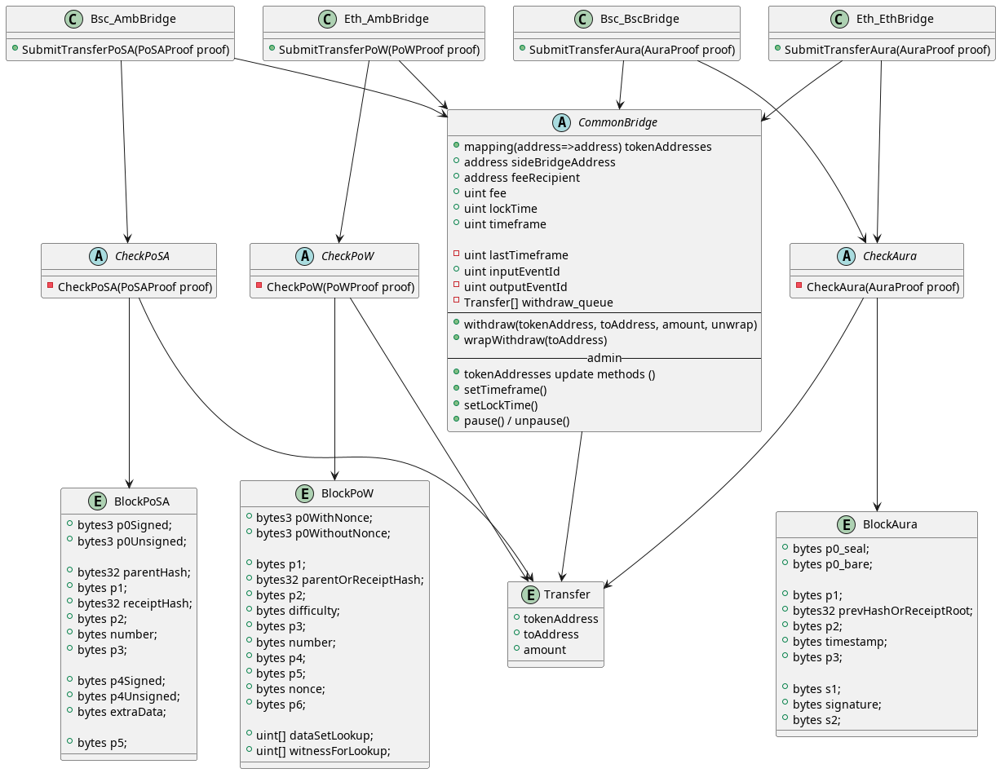

## Tokens
Inside the bridge there is a division into types of tokens: primary and synthetic.

**Primary** tokens are those that already exist in a network and we plan to make it possible to transport them by bridge.

**Synthetics** tokens are the ones we create as a pair to primary ones.   
They know about the existence of the bridge and its address and **allow it to mint and burn** tokens.  
They also monitor how much and from which network funds came and do not allow to withdraw to this network more than came from it.


## Bridge
The bridge consists of **2 contracts**, one for each network and a **relay** - software that monitors these contracts and sends them user transfers.

in a nutshell, the bridge works as follows:
1. the user calls the `withdraw` function in the contract `A`; he's tokens locks on bridge contract
2. this contract emits an `Transfer` event
3. relay find new event, prepare a proof and call `submit` function on contract `B` (another network) 
4. contract `B` checks (using proof) that `Transfer` event really emitted in first network by contract `A` 
5. if check successful, contract `B` mint synthetic analog of primary token to user


Since for withdrawal of funds contract B independently checks that contract A actually created the Transfer event,  
and the relay is needed only to send public information,  
**the bridge can be called trustless** and therefore protected from burglary relay


### Fees

Bridge collects 2 types of commissions from the user:
- Transfer fee - covering the cost of the relay performing transactions in side network
- Bridge fee - percentage of the amount of tokens sent  
Fees are converted into the native currency of the network


### Contracts
 
We currently have 2 networks we work with: AMB-**ETH** and AMB-**BSC**.  

So, we have 4 contracts:
- `Eth_AmbBridge` - deployed on AMB, receive transfers from ETH
- `Eth_EthBridge` - deployed on ETH, receive transfers from AMB
- `Bsc_AmbBridge` - deployed on AMB, receive transfers from BSC
- `Bsc_BscBridge` - deployed on ETH, receive transfers from AMB


Each contract is inherited from `CommonBridge` and `CheckXxXxX`

`CommonBridge` is a contract that has all the code common to all contracts, such as:
- `withdraw` and `wrapWithdraw` functions - called by users to transfer tokens from this network to another.
- locking, unlocking functionality - all received transfers firstly locked for some time to avoid fraud.
- administration - functions for changing variables, roles, etc.
- verification and distribution of the fees
- and so on

`CheckXxXxX`, which can mean `CheckAura`, `CheckPoW`, `CheckPoSA`, - is contracts, that verify that `Transfer` event happened in other (side) network.  

In general, these contracts do the same thing:
they check that there is a `Transfer` event in a certain block with the same information that the relay sent,
and also checks ~ 10 (`minSafetyBlocks` param) next blocks.

But the principle of checking blocks is different for different networks:

- `CheckAura` (for blocks from Ambrosus) - check author of each block, it must be specific validator from Validator Set.       
  `assert block.author == block.step % validatorSet.length`  
   Need to sync ValidatorSet from contract (`0x0000000000000000000000000000000000000F00`) into receiver network.


- `CheckPoSA` (for blocks from Binance Smart Chain) - check author of each block, it must be validator from Validator Set.  
  `assert validatorSet[block.author]`  
   Need to sync ValidatorSet from each epoch start block (`block.number % 200 == 0`) into receiver network.

  
- `CheckPoW` (for blocks from Ethereum 1.0) - check PoW hash for each block, it must be suitable with network difficulty.


For each checker relay prepare proof (`PoWProof`, `PoSAProof`, `AuraProof`) - struct, that contains necessary information, like blocks, user transfers, etc... 



Smart contracts structure


## Flow


### frontend

1. юзер заходит на фронт
2. фронт берет список всех токенов, их иконки и т.д.  
3. фронт делает запросы на релей что бы узнать transfer fee и bridge fee
4. юзер вызывает функцию `withdraw` у контракта бриджа в сети, из которой он хочет вывести деньги

### bridge withdraw

`withdraw(address tokenThisAddress, address toAddress, uint amount, bool unwrapSide,
bytes calldata feeSignature, uint transferFee, uint bridgeFee)`

1. проверяются входные данные

2. информация о выводе добавляется в очередь `Transfer[] withdraw_queue`
    ```
    struct Transfer {
        address tokenAddress;
        address toAddress;
        uint amount;
    }
    ```

3. пока вызовы `withdraw` происходят в одном таймфрейме - трансферы просто добавляются в очередь.  
как только очередной вызов `withdraw` происходит в новом таймфрейме:
   - создается эвент `Transfer(event_id, withdraw_queue)`
   - withdraw_queue очищается
   - event_id инкрементируется на 1

    _таймфрейм = block.timestamp / timeframe_


### relay

1. relay получает ивент `Transfer(event_id, withdraw_queue)` c AmbBridge
2. сверяет что `event_id == EthBridge.inputEventId + 1`, иначе ищет Transfer c подходящим event_id
3. ждет N следующих блоков (safety blocks)
4. создает receipts proof (см ниже)
5. кодирует блоки (блок с эвентом и safety) в зависимости от консенсуса сети: BlockPoA или BlockPoW (см ниже)
6. вызывает у EthBridge метод `submitTransfers`
    

### bridge submitTransfers
```
submitTransfers(
    uint event_id,
    BlockPoA[] memory blocks,
    Transfer[] memory events,
    bytes[] memory proof
)
```

1. `require(event_id == inputEventId + 1);` - проверка что эвенты приходят последовательно, без пропусков.  
`inputEventId++;`

2. считается receiptsRoot, в следующей функции проверяется что блок с таким receiptsRoot валидный 

3. вызывается _CheckPoW или _CheckPoA в зависимости от консенсуса сети с которой пришли блоки:
   - для PoA проверяется что подписан именно этот блок и подпись сделана правильным адресом (определяется по полю step) 
   - PoW проверяется с использованием ethash (_coming soon_)
   
    неявно проверяется что `hash(blocks[i]) == blocks[i+1].prev_hash`

4. трансферы сохраняются в пул залоченных транзакций

### bridge unlockTransfers

1. достает из пула залоченных транзакций те, которые сохранены раньше чем `block.timestamp - lockTime`
2. переводит токены
3. удаляет из пула выполненные транзакции


## Extra


### Block pre-encoding

Что бы доказать что блок правильный нужно считать его хеш.

```
blockHeader = {
    ParentHash, UncleHash, Coinbase, Root, TxHash,
    ReceiptHash, 
    Bloom, Difficulty, Number, GasLimit, GasUsed,
    Time, Extra, MixDigest, Nonce
}

blockHash = keccak256(rlpEncode(blockHeader))
assert blockHash == needHash
```

Хешируемое значение почти всегда сначала кодируется в RLP (Recursive Length Prefix).   
Эта кодировка только добавляет к входному значению префикс, а значит входное значение с каким то смещением содержится в выходном.  
=> `rlpEncode(value) = rlpPrefix(value) + value`, где + означает конкатенацию байт.


Для экономии газа relay будет подготавливать блоки для смарт контракта таким образом, 
что бы вместо `rlpEncode` использовать конкатенацию (`abi.encodePacked`).

Например, relay может разбить `rlpEncode(header)` по разделителю `receiptRoot`  
`rlpParts := bytes.Split(rlpHeader, receiptRoot)`, тогда  
`keccak256(abi.encodePacked(rlpParts[0], receiptRoot, rlpParts[1]) == needHash`


### Receipts proof (todo)


simplified example of merkle patricia tree:
```
receiptsRoot = hash(rlpEncode(childrens)
├── path1 = hash(rlpEncode(childrens)
│   ├── receipt1
│   ├── receipt2
│   ├── receipt...
│   └── receipt16
├── path2 = hash(rlpEncode(childrens)
│   ├── receipt1
│   ├── receipt2
│   ├── receipt...
│   ├── receipt6
│   │   ├── someReceiptInfo
│   │   ├── **eventData**
│   │   └── someMoreReceiptInfo
│   ├── receipt...
│   └── receipt16
└── path3 = hash(rlpEncode(childrens)
    ├── receipt1
    ├── receipt...
    └── receipt16
```

smart contract have `eventData` as function argument and `receiptsRoot` as `blocks[0].prevHashOrReceiptRoot`,  
so we need to provide other data to check if `eventData` was in trie.

simplify trie

```
receiptsRoot = hash(path1 + path2 + path3)
├── path1 = hash(rlpEncode(childrens)
├── path2 = hash(rlpEncode(p1 + eventData + p2)
│   ├── p1 = rlpEncode(receipt1-receip5) + someReceipt6InfoRLP
│   ├───── eventData
│   └── p2 = someMoreReceipt6InfoRLP + rlpEncode(receipt7-receipt16)
└── path3 = hash(rlpEncode(childrens)

```

=>

path2 = hash(p1 + eventData + p2)  
receiptsRoot = hash(path1 + path2 + path3)

=>

```bytes[] proof = [p1, p2, path1, path3, ...]```

check

```
hash(abi.encodePacked(
    p5,
    hash(abi.encodePacked(
        p3, 
        hash(abi.encodePacked(
            p1,
            eventData,
            p2
        )),
        p4
    )),
    p6
) == header.receiptsRoot
```


### Fees API
#### Endpoint: /fees
#### Method: POST

#### Request body params:
- `tokenAddress` - string, hex address of token in **from** network
- `isAmb` - bool, is the **from** network is **AMB**
- `amount` - string, amount of tokens in hex
- `isAmountWithFees` - bool, is the amount includes fees (used with "set max" button on the frontend)

#### Response params:
- `bridgeFee` - string, bridge fee in hex
- `transferFee` - string, transfer fee in hex
- `amount` - string, used amount in calculation fees (useful when param `isAmountWithFees` has used)
- `signature` - string, signature of the data

#### Examples:
Request body:
- **URL**: http://localhost:8080/fees
- **Body**:
```json
{
  "tokenAddress": "0xc778417E063141139Fce010982780140Aa0cD5Ab",
  "isAmb": true,
  "amount": "0xDE0B6B3A7640000",
  "isAmountWithFees": false
}
```

- Success request:
    - **Status code**: 200
    - **Result**:
  ```json
  {
    "bridgeFee": "0xbc4b381d188000",
    "transferFee": "0xe8d4a51000",
    "amount": "0xDE0B6B3A7640000",
    "signature": "0x6105ca999d43b1f1182d4955f5706e8bf27097b8cb80da35c04016238e2adff91e38f275d640911a46b208d0bb7239d83d5e427b7b93b0cd7390034d724bdb0500"
  }
  ```

- Failure request (wrong request body):
    - **Status code**: 400
    - **Result**:
  ```json
  {
    "message": "error when decoding request body",
    "developerMessage": "якась помилка"
  }
  ```

- Failure request (internal error):
    - **Status code**: 500
    - **Result**:
  ```json
  {
    "message": "error when getting bridge fee",
    "developerMessage": "якась помилка"
  }
  ```
  
- Failure request (when `isAmountWithFees` is true and `amount` is too small):
    - **Status code**: 500
    - **Result**:
  ```json
  {
    "message": "amount is too small"
  }
  ```
